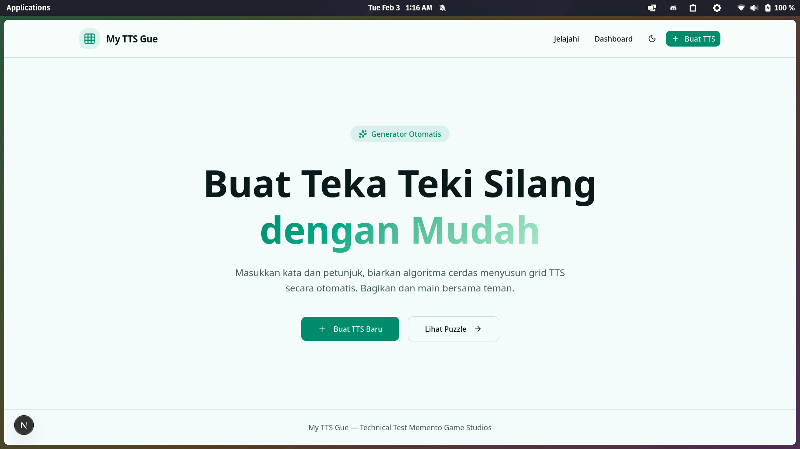
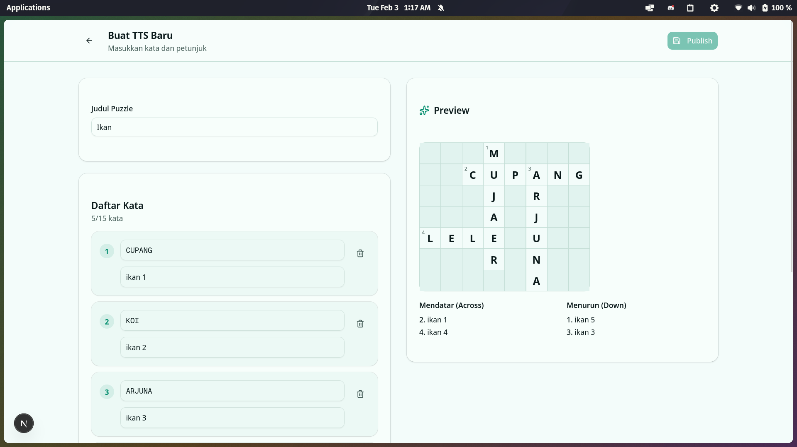
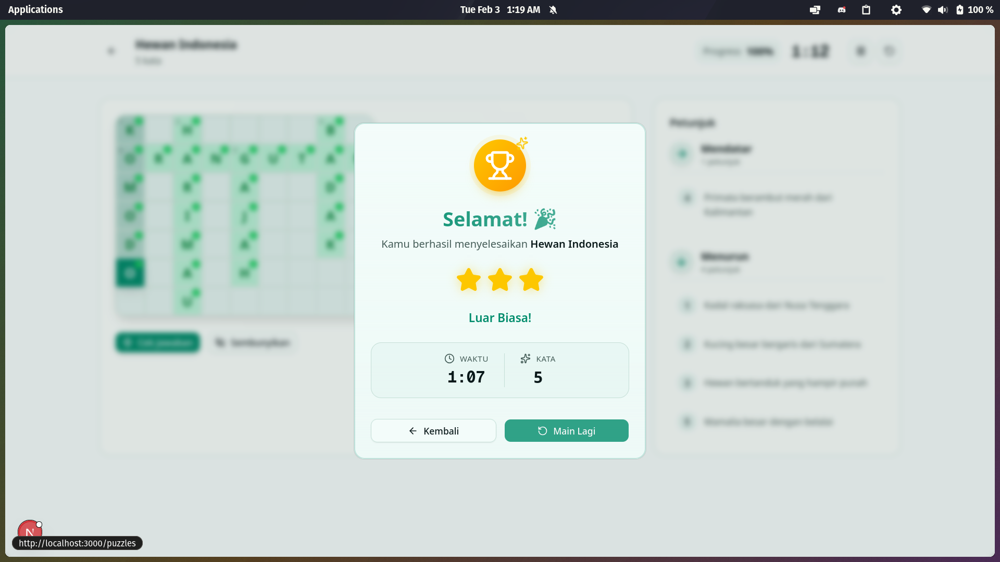

# TTS Indonesia - Crossword Puzzle Application

Aplikasi pembuat dan pemain Teka Teki Silang (TTS) Indonesia dengan generator grid otomatis menggunakan algoritma intersection-based placement.


## Deskripsi

TTS Indonesia adalah aplikasi web yang memungkinkan pengguna untuk:
- **Membuat** puzzle TTS sendiri dengan input kata dan petunjuk
- **Publish** puzzle agar bisa dimainkan
- **Memainkan** puzzle TTS secara interaktif dengan keyboard navigation

Aplikasi ini dilengkapi dengan algoritma otomatis untuk menentukan tata letak kata (mendatar/menurun) berdasarkan intersection huruf yang sama.

## Tech Stack

| Kategori | Teknologi |
|----------|-----------|
| Framework | Next.js 16 (App Router) |
| Language | TypeScript |
| Styling | Tailwind CSS v4 + shadcn/ui |
| Animation | Framer Motion |
| Database | PostgreSQL + Prisma 7 |
| Server State | TanStack Query |
| Client State | TanStack Store |
| Session | Iron Session |

## Daftar Fitur

### Admin Panel
- Form input kata dan petunjuk (5-15 kata)
- Auto-generate TTS dengan algoritma intersection
- Preview grid real-time sebelum publish
- Dashboard daftar puzzle dengan filter & search
- Edit & hapus puzzle
- Toggle status Published/Draft dengan Switch

### Player Interface
- Grid TTS interaktif dengan animasi (Framer Motion)
- Navigasi keyboard (Arrow keys, Tab untuk ganti arah)
- Klik clue untuk fokus ke kata
- Validasi jawaban dengan visual feedback (glow effect)
- Timer dengan auto-start
- Progress tracking (persentase)
- Modal completion dengan confetti animation
- Star rating berdasarkan waktu penyelesaian

### Extra Features
- Dark/Light mode toggle
- Fully responsive design (mobile-first)
- Puzzle completion tracking (localStorage)
- URL sharing untuk setiap puzzle
- Sample puzzles tersedia (via seeder)

## Screenshots

### Halaman Utama


### Membuat Puzzle


### Bermain TTS


### Puzzle Selesai


## 🎬 Video Demo

[Link Video Demo](https://youtube.com/watch?v=xxxxx)

Video menunjukkan:
1. Membuka aplikasi dan halaman utama
2. Membuat TTS baru dengan kata dan petunjuk
3. Preview dan publish puzzle
4. Memainkan TTS sampai selesai
5. Modal completion dengan animasi

## Cara Menjalankan di Lokal

### Prerequisites

- Node.js 18+ atau Bun 1.0+
- PostgreSQL database

### Installation

```bash
# Clone repository
git clone https://github.com/username/tts-app.git
cd tts-app

# Install dependencies
bun install

# Setup environment
cp .env.example .env
```
### Database Setup

```bash
# Push schema ke database
bun run db:push

# Jalankan seeder untuk sample puzzles (2-3 puzzle contoh)
bun run db:seed

# (Opsional) Buka Prisma Studio untuk melihat data
bun run db:studio
```

### Development

```bash
bun run dev
```

Buka [http://localhost:3000](http://localhost:3000)

## Project Structure

```
tts-app/
├── src/
│   ├── app/                    # Next.js App Router
│   │   ├── admin/              # Admin panel pages
│   │   ├── api/                # API routes
│   │   ├── play/[id]/          # Player page
│   │   ├── puzzles/            # Puzzle listing
│   │   └── page.tsx            # Landing page
│   ├── features/               # Feature-based modules
│   │   ├── admin/              # Admin feature
│   │   │   ├── components/     # UI components
│   │   │   ├── containers/     # Page containers
│   │   │   ├── data/           # Data fetching
│   │   │   ├── hooks/          # Custom hooks
│   │   │   └── types/          # TypeScript types
│   │   ├── player/             # Player feature (same structure)
│   │   └── puzzle/             # Puzzle listing feature
│   └── shared/                 # Shared utilities
│       ├── components/         # Reusable components
│       │   └── ui/             # shadcn/ui components
│       ├── hooks/              # Common hooks
│       ├── lib/                # Core utilities & algorithm
│       ├── repository/         # Data access layer
│       └── store/              # State management
└── prisma/
    ├── schema.prisma           # Database schema
    └── seed.ts                 # Seeder script
```

---

# Dokumentasi Algoritma

## Masalah yang Dihadapi

### Tantangan Utama: Menentukan Tata Letak Kata

Kesulitan utama dalam membuat TTS generator adalah **menentukan apakah sebuah kata harus ditempatkan secara mendatar (across) atau menurun (down)**, dan di posisi mana pada grid.

**Masalah spesifik yang saya hadapi:**
1. Bagaimana menentukan kata mana yang harus ditempatkan duluan?
2. Bagaimana menemukan intersection yang valid antar kata?
3. Bagaimana menghindari konflik (kata yang saling bertabrakan)?
4. Bagaimana memilih posisi dan arah terbaik dari banyak kemungkinan?

## Solusi: Intersection-Based Placement Algorithm

### Konsep Dasar

Algoritma bekerja dengan prinsip **greedy placement** - menempatkan kata satu per satu berdasarkan intersection (huruf yang sama) dengan kata yang sudah ada. Arah (mendatar/menurun) ditentukan secara otomatis berdasarkan intersection yang ditemukan.

### Cara Mengatasi Masalah Arah Kata

Saat mencari posisi untuk kata baru, algoritma:
1. **Scan seluruh grid** untuk mencari huruf yang cocok
2. **Coba kedua arah** (horizontal DAN vertikal) untuk setiap intersection point
3. **Validasi** apakah penempatan di arah tersebut tidak konflik
4. **Score** berdasarkan jumlah intersection
5. **Pilih posisi dengan score tertinggi** - arah otomatis ikut terpilih

Dengan pendekatan ini, arah kata tidak perlu ditentukan manual - algoritma secara otomatis memilih arah yang menghasilkan crossword paling terhubung.

### Langkah-langkah Algoritma

```
1. SORT: Urutkan kata berdasarkan panjang (terpanjang dulu)
   └── Kata panjang lebih sulit ditempatkan, jadi prioritaskan

2. PLACE FIRST: Tempatkan kata pertama di tengah grid (horizontal)
   └── Memberikan ruang maksimal untuk kata berikutnya

3. FOR EACH remaining word:
   a. FIND INTERSECTIONS
      └── Scan grid untuk huruf yang sama
      └── Coba posisi horizontal DAN vertikal untuk setiap match
   
   b. VALIDATE each position:
      └── Tidak keluar grid
      └── Tidak ada huruf yang konflik
      └── Tidak ada kata paralel yang menempel
      └── Ada ruang kosong sebelum dan sesudah kata
   
   c. SCORE positions:
      └── Hitung jumlah intersection
      └── Pilih posisi dengan intersection terbanyak
   
   d. PLACE word at best position
      └── Jika tidak ada posisi valid, tandai sebagai unplaced

4. TRIM: Potong grid ke ukuran minimal

5. ASSIGN NUMBERS: Beri nomor urut untuk clue
```

### Implementasi Kode Kunci

File: `src/shared/lib/crossword-generator.ts`

#### 1. Mencari Intersection (Solusi untuk Masalah Arah)

```typescript
/**
 * Mencari semua posisi valid untuk menempatkan kata
 * KUNCI: Mencoba KEDUA arah untuk setiap intersection point
 */
function findIntersections(
  word: string,
  placedWords: PlacedWord[],
  grid: GridCell[][]
): Position[] {
  const positions: Position[] = [];
  
  // Untuk setiap huruf dalam kata yang akan ditempatkan
  for (let i = 0; i < word.length; i++) {
    const char = word[i];
    
    // Scan seluruh grid untuk huruf yang sama
    for (let y = 0; y < GRID_SIZE; y++) {
      for (let x = 0; x < GRID_SIZE; x++) {
        if (grid[y][x].letter === char) {
          
          // COBA HORIZONTAL: tempatkan kata mendatar
          const acrossStart = x - i;
          if (canPlaceWord(word, acrossStart, y, "across", grid)) {
            positions.push({
              x: acrossStart, y,
              direction: "across",
              intersections: countIntersections(...)
            });
          }
          
          // COBA VERTIKAL: tempatkan kata menurun
          const downStart = y - i;
          if (canPlaceWord(word, x, downStart, "down", grid)) {
            positions.push({
              x, y: downStart,
              direction: "down",
              intersections: countIntersections(...)
            });
          }
        }
      }
    }
  }
  
  // Urutkan: posisi dengan intersection terbanyak di atas
  // Ini otomatis memilih arah terbaik
  return positions.sort((a, b) => b.intersections - a.intersections);
}
```

#### 2. Validasi Penempatan

```typescript
/**
 * Validasi apakah kata bisa ditempatkan di posisi tertentu
 * Mengecek boundary, konflik huruf, dan adjacency rules
 */
function canPlaceWord(
  word: string,
  startX: number,
  startY: number,
  direction: "across" | "down",
  grid: GridCell[][]
): boolean {
  // Cek boundary
  if (startX < 0 || startY < 0) return false;
  if (direction === "across" && startX + word.length > GRID_SIZE) return false;
  if (direction === "down" && startY + word.length > GRID_SIZE) return false;
  
  // Cek ruang kosong sebelum kata (mencegah kata menyambung)
  const beforeX = startX - (direction === "across" ? 1 : 0);
  const beforeY = startY - (direction === "down" ? 1 : 0);
  if (grid[beforeY]?.[beforeX]?.letter !== null) return false;
  
  // Cek ruang kosong sesudah kata
  const afterX = startX + (direction === "across" ? word.length : 0);
  const afterY = startY + (direction === "down" ? word.length : 0);
  if (grid[afterY]?.[afterX]?.letter !== null) return false;
  
  // Cek setiap sel
  for (let i = 0; i < word.length; i++) {
    const x = startX + (direction === "across" ? i : 0);
    const y = startY + (direction === "down" ? i : 0);
    const cell = grid[y][x];
    
    // Jika sel sudah terisi, harus huruf yang sama (valid intersection)
    if (cell.letter !== null && cell.letter !== word[i]) {
      return false;
    }
    
    // Jika sel kosong, cek tidak ada kata paralel yang menempel
    if (cell.letter === null) {
      if (direction === "across") {
        if (grid[y-1]?.[x]?.letter || grid[y+1]?.[x]?.letter) return false;
      } else {
        if (grid[y]?.[x-1]?.letter || grid[y]?.[x+1]?.letter) return false;
      }
    }
  }
  
  return true;
}
```

#### 3. Main Generator

```typescript
/**
 * Main function untuk generate crossword
 * Menggunakan greedy algorithm dengan intersection scoring
 */
export function generateCrossword(words: WordInput[]): GeneratedGrid {
  // Sort berdasarkan panjang (terpanjang dulu - lebih sulit ditempatkan)
  const sortedWords = [...words].sort((a, b) => b.text.length - a.text.length);
  
  const grid = createEmptyGrid();
  const placedWords: PlacedWord[] = [];
  const unplacedWords: string[] = [];
  
  // Tempatkan kata pertama di tengah (horizontal)
  const firstWord = sortedWords[0];
  placeWord(firstWord, centerX, centerY, "across", grid);
  
  // Tempatkan kata-kata berikutnya
  for (let i = 1; i < sortedWords.length; i++) {
    const word = sortedWords[i];
    const positions = findIntersections(word, placedWords, grid);
    
    if (positions.length > 0) {
      // Ambil posisi terbaik (intersection terbanyak)
      // Arah sudah termasuk dalam posisi ini
      const bestPos = positions[0];
      placeWord(word, bestPos.x, bestPos.y, bestPos.direction, grid);
      placedWords.push(word);
    } else {
      // Tidak bisa ditempatkan
      unplacedWords.push(word.text);
    }
  }
  
  // Trim dan assign nomor
  const { trimmedGrid, width, height } = trimGrid(grid);
  const numberedWords = assignNumbers(placedWords);
  
  return { grid: trimmedGrid, words: numberedWords, width, height, unplacedWords };
}
```

## Fitur Tambahan yang Dibuat

1. **Completion Tracking** - Menyimpan puzzle yang sudah diselesaikan di localStorage
2. **Animated Completion Modal** - Confetti effect dan star rating berdasarkan waktu
3. **Keyboard Navigation** - Arrow keys dan Tab untuk navigasi grid
4. **Real-time Preview** - Preview grid saat menambahkan kata
5. **Responsive Design** - Mobile-first dengan card view untuk table di mobile

## API Endpoints

| Method | Endpoint | Description |
|--------|----------|-------------|
| GET | `/api/puzzles` | List published puzzles |
| POST | `/api/puzzles` | Create new puzzle |
| GET | `/api/puzzles/[id]` | Get puzzle by ID |
| PUT | `/api/puzzles/[id]` | Update puzzle |
| DELETE | `/api/puzzles/[id]` | Delete puzzle |
| POST | `/api/puzzles/generate` | Generate preview grid |

---

**Technical Test - Memento Game Studios**
